# 📊 Financial Risk Analyzer - Complete Developer Guide

*Welcome, new engineer! This guide will help you understand our Financial Risk Analyzer codebase using real-world metaphors and clear explanations.*

---

## 🌟 What Is This Application?

Think of our **Financial Risk Analyzer** as a **sophisticated medical diagnostic system for companies**. Just like how doctors run tests to determine if a patient is healthy or at risk of illness, our system analyzes companies' financial "vital signs" to predict if they might face bankruptcy or financial distress.

### 🏥 The Medical Metaphor

| Medical World | Our Financial App |
|---------------|------------------|
| **Patient** | **Company** (Apple, Microsoft, etc.) |
| **Blood Test** | **Financial Data** (revenue, debt, assets) |
| **Medical Scanner** | **AI Analysis Service** |
| **Diagnosis** | **Altman Z-Score** (bankruptcy risk) |
| **Medical Report** | **PDF Analysis Report** |
| **Hospital System** | **Our Web Application** |

---

## 🏗️ Architecture Overview

Our application is like a **modern hospital with different departments**:

```
🏥 FINANCIAL RISK ANALYZER HOSPITAL
├── 🚪 Reception (Frontend - React)
├── 🔬 Laboratory (Backend Services)
│   ├── 📊 Data Collection Unit (Financial Data Service)
│   ├── 🧮 Analysis Lab (Ratio Calculator Service)
│   ├── 🤖 AI Diagnostics (AI Analysis Service)
│   └── 📋 Report Generator (PDF Reports)
├── 📡 Communication System (API Routes)
└── 🗄️ Medical Records (Database/Cache)
```

### 🏢 Project Structure

```
financial-risk-analyzer/
├── 🚪 frontend/                 # The Reception Desk (React UI)
│   ├── src/components/          # UI Components (Forms, Displays)
│   ├── src/services/           # Frontend API Communication
│   └── src/styles/             # Visual Styling
├── 🔬 services/                # The Laboratory (Business Logic)
│   ├── financialDataService.js # Data Collection
│   ├── ratioCalculatorService.js # Mathematical Analysis
│   ├── aiAnalysisService.js    # AI-Powered Insights
│   └── reportGeneratorService.js # Report Generation
├── 📡 routes/                  # Communication Channels (APIs)
│   ├── analysis.js             # Main Analysis Endpoints
│   ├── company.js              # Company Data Endpoints
│   └── report.js               # Report Generation
├── 🗄️ uploads/                # Temporary File Storage
└── 📋 server.js               # Main Hospital Director
```

---

## 🔄 How It All Works (The Patient Journey)

### 1. 🚪 **Reception (Frontend)**
```javascript
// Like a hospital reception where patients check in
// Users can input companies individually or upload a CSV list
```

**Real-world analogy**: When you visit a hospital, you first go to reception to register. Similarly, users come to our web interface to "register" companies for analysis.

### 2. 📋 **Patient Registration (Input Processing)**
```javascript
// InputSection.js - Like filling out medical forms
const handleAnalysis = async (companies) => {
  // Prepare the "patient list" for examination
  const results = await analyzeCompanies(companies);
};
```

### 3. 🔬 **Laboratory Tests (Data Collection)**
```javascript
// financialDataService.js - Like running blood tests
async resolveCompanyTicker(companyInput) {
  // Find the right "patient" in our records
  // Get their "vital signs" (financial data)
}
```

**Real-world analogy**: Just like a lab technician needs to find the right patient and collect blood samples, our Financial Data Service finds the right company and collects its financial "vital signs."

### 4. 🧮 **Medical Analysis (Ratio Calculations)**
```javascript
// ratioCalculatorService.js - Like analyzing blood test results
calculateAltmanZScore(balanceSheet, incomeStatement, marketData) {
  // Calculate the "health score" like cholesterol levels
  // Determine if the company is "healthy" or "at risk"
}
```

### 5. 🤖 **Expert Consultation (AI Analysis)**
```javascript
// aiAnalysisService.js - Like consulting with a specialist doctor
async generateAnalysis(company, ratios, marketData) {
  // Get AI expert opinion on the financial health
  // Provide recommendations like a specialist would
}
```

### 6. 📋 **Medical Report (PDF Generation)**
```javascript
// reportGeneratorService.js - Like creating a comprehensive medical report
async generatePDFReport(analysisResults) {
  // Create a detailed report for the "patient"
  // Include diagnosis, recommendations, and charts
}
```

---

## 🧩 Key Components Explained

### 🚪 Frontend Components (The Hospital Reception)

#### **InputSection.js** - Registration Desk
```javascript
// Like the hospital intake form
// Patients can register individually or in groups (CSV upload)
const InputSection = ({ onAnalyze }) => {
  // Two ways to check in:
  // 1. Individual company entry (walk-in patient)
  // 2. CSV batch upload (group medical screening)
};
```

**What it does**: 
- Allows users to input companies for analysis
- Supports individual entry or CSV batch upload
- Validates input and shows preview of companies

#### **CompanyCard.js** - Patient File Display
```javascript
// Like a patient's medical chart on the wall
// Shows the company's "vital signs" and diagnosis
const CompanyCard = ({ company, analysis }) => {
  // Display financial health status
  // Show risk level with color coding (green=healthy, red=critical)
};
```

#### **AnalysisResults.js** - Medical Results Board
```javascript
// Like the results board in a doctor's office
// Shows all analyzed companies and their health status
```

### 🔬 Backend Services (The Laboratory)

#### **FinancialDataService.js** - Data Collection Lab
```javascript
class FinancialDataService {
  // Like a lab that collects blood samples from multiple sources
  constructor() {
    this.dataSources = {
      alphavantage: { /* Source 1: Like Lab A */ },
      financialModelingPrep: { /* Source 2: Like Lab B */ },
      yahooFinance: { /* Source 3: Like Lab C */ }
    };
  }
}
```

**Real-world analogy**: Just like hospitals get lab results from multiple testing facilities to ensure accuracy, we collect financial data from multiple sources (Alpha Vantage, Financial Modeling Prep, Yahoo Finance) to get comprehensive and reliable information.

#### **RatioCalculatorService.js** - Analysis Laboratory
```javascript
class RatioCalculatorService {
  // Like a medical lab that analyzes blood samples
  calculateAltmanZScore(balanceSheet, incomeStatement, marketData) {
    // Calculate financial ratios like:
    // - Liquidity ratios (like blood pressure)
    // - Leverage ratios (like cholesterol levels)
    // - Profitability ratios (like heart rate)
    
    // The Altman Z-Score is like an overall health score
    // Z > 2.99 = Healthy (green zone)
    // 1.8 < Z < 2.99 = Caution (yellow zone)  
    // Z < 1.8 = High risk (red zone)
  }
}
```

#### **AIAnalysisService.js** - Specialist Consultant
```javascript
class AIAnalysisService {
  // Like consulting with a financial specialist doctor
  async generateAnalysis(company, ratios, marketData) {
    // Use OpenAI (like consulting with an expert)
    // Provide human-readable diagnosis and recommendations
  }
}
```

#### **ReportGeneratorService.js** - Medical Records Department
```javascript
class ReportGeneratorService {
  // Like creating comprehensive medical reports
  async generatePDFReport(analysisResults) {
    // Create professional reports with:
    // - Charts and graphs (like X-rays)
    // - Analysis summary (like diagnosis)
    // - Recommendations (like treatment plan)
  }
}
```

---

## 📡 API Routes (Hospital Communication System)

### 🔬 Analysis Routes (`/api/analysis/`)
```javascript
// routes/analysis.js - Main diagnostic center

// POST /api/analysis/analyze
// Like: "Please analyze these patients"
router.post('/analyze', async (req, res) => {
  // Receive list of companies to analyze
  // Run them through our diagnostic process
  // Return health status for each
});

// POST /api/analysis/upload  
// Like: "Here's a list of patients for group screening"
router.post('/upload', upload.single('file'), async (req, res) => {
  // Accept CSV file with company names
  // Parse and validate the list
  // Return processed company list
});
```

### 🏢 Company Routes (`/api/company/`)
```javascript
// routes/company.js - Patient information center

// GET /api/company/search/:query
// Like: "Find patient records for John Smith"
router.get('/search/:query', async (req, res) => {
  // Search for company information
  // Return basic company details
});
```

### 📋 Report Routes (`/api/report/`)
```javascript
// routes/report.js - Medical records department

// POST /api/report/generate
// Like: "Generate medical report for this patient"
router.post('/generate', async (req, res) => {
  // Create comprehensive PDF report
  // Include charts, analysis, recommendations
});
```

---

## 🔄 Data Flow (The Complete Patient Journey)

```mermaid
graph TD
    A[👤 User inputs companies] --> B[🔍 Validate & search companies]
    B --> C[📊 Fetch financial data]
    C --> D[🧮 Calculate ratios & Z-Score]
    D --> E[🤖 Generate AI analysis]
    E --> F[📋 Create comprehensive report]
    F --> G[📱 Display results to user]
    
    C --> H[💾 Cache data for 5 minutes]
    H --> C
```



### Step-by-Step Process

1. **🚪 User Input**: User enters "Apple" or "AAPL"
2. **🔍 Company Resolution**: Find the correct ticker symbol (AAPL)
3. **📊 Data Collection**: Gather financial statements from APIs
4. **🧮 Ratio Calculation**: Calculate 20+ financial ratios
5. **🤖 AI Analysis**: Generate human-readable insights
6. **📋 Report Generation**: Create PDF report with charts
7. **📱 Display Results**: Show results with risk assessment

---

## 🛠️ Technologies Used

### 🏗️ Backend (Hospital Infrastructure)
```javascript
{
  "express": "Web server framework (hospital building)",
  "axios": "API client (courier service)",
  "multer": "File upload handler (document scanner)",
  "csv-parser": "CSV file reader (spreadsheet reader)",
  "puppeteer": "PDF generator (printing machine)",
  "openai": "AI analysis (medical specialist)",
  "node-cache": "Temporary storage (short-term memory)",
  "helmet": "Security middleware (security guard)",
  "cors": "Cross-origin requests (visitor pass system)"
}
```

### 🎨 Frontend (Hospital Reception)
```javascript
{
  "react": "User interface framework (reception desk)",
  "axios": "API communication (phone system)",
  "react-hot-toast": "Notifications (announcement system)",
  "lucide-react": "Icons (signage system)"
}
```

---

## 🎯 Key Features

### 🔍 Smart Company Search
```javascript
// Like having a smart patient directory
// Can find companies by:
// - Exact ticker (AAPL)
// - Company name (Apple Inc.)
// - Partial matches (Appl...)
```

### 📊 Comprehensive Analysis
```javascript
// Like a full medical checkup including:
const analysisIncludes = {
  liquidityRatios: "Cash flow health (blood circulation)",
  leverageRatios: "Debt health (blood pressure)", 
  profitabilityRatios: "Earning health (heart rate)",
  altmanZScore: "Overall bankruptcy risk (health score)",
  aiInsights: "Expert recommendations (doctor's advice)"
};
```

### 📋 Professional Reports
```javascript
// Like comprehensive medical reports with:
// - Visual charts and graphs
// - Risk assessment summary  
// - Detailed recommendations
// - Executive-friendly format
```

### 🔄 Batch Processing
```javascript
// Like group medical screening
// Upload CSV with multiple companies
// Analyze all at once
// Get comprehensive portfolio health report
```

---

## 🚀 Getting Started

### 1. 🏥 Setup the Hospital (Installation)
```bash
# Install main hospital systems
npm install

# Setup the reception desk (frontend)
cd frontend && npm install

# Return to main directory
cd ..
```

### 2. 🔑 Get API Keys (Medical Equipment Licenses)
Create `.env` file with your "equipment licenses":
```bash
# Financial data sources (lab equipment)
ALPHA_VANTAGE_API_KEY=your_key_here
FINANCIAL_MODELING_PREP_API_KEY=your_key_here
FINNHUB_API_KEY=your_key_here

# AI specialist consultation
OPENAI_API_KEY=your_key_here

# Hospital settings
NODE_ENV=development
PORT=3001
```

### 3. 🏃‍♂️ Start the Hospital
```bash
# Start both backend and frontend
npm run dev:full

# Or start individually:
npm run dev          # Backend only (port 3001)
cd frontend && npm start  # Frontend only (port 3000)
```

### 4. 🌐 Visit the Hospital
- **Reception Desk**: http://localhost:3000 (Frontend)
- **Internal Systems**: http://localhost:3001/api (Backend APIs)

---

## 🧪 Testing the System

### 🩺 Basic Health Check
```bash
# Test if the hospital is running
curl http://localhost:3001/api/health
```

### 👤 Analyze a Single Company
1. Go to http://localhost:3000
2. Enter "AAPL" or "Apple"
3. Click "Analyze"
4. View the financial health report

### 📋 Analyze Multiple Companies
1. Create a CSV file with company names/tickers
2. Use the "Batch Upload" tab
3. Upload your CSV file
4. Select which companies to analyze
5. Get comprehensive portfolio report

---

## 🛠️ Common Issues & Solutions

### 🚨 "Company not found" Error
**Problem**: Like trying to find a patient who's not in the system
**Solution**: 
- Use exact ticker symbols (AAPL, not Apple)
- Check spelling
- Ensure company is publicly traded

### 🔑 API Rate Limits
**Problem**: Like running out of lab tests for the day
**Solution**:
- Wait for rate limit reset
- Use multiple API keys
- Implement caching (already done!)

### 💾 Server Memory Issues
**Problem**: Like the hospital computer running out of memory
**Solution**:
- Use memory storage for Vercel (already implemented)
- Clear cache periodically
- Optimize file processing

### 📊 Missing Financial Data
**Problem**: Like incomplete medical records
**Solution**:
- Try different company ticker
- Check if company has recent financial filings
- Use alternative data sources

---

## 🔧 Development Workflow

### 🌿 Making Changes
```bash
# 1. Create feature branch (like opening new medical department)
git checkout -b feature/new-analysis-metric

# 2. Make changes to code
# 3. Test locally

# 4. Commit changes (like updating medical records)
git add .
git commit -m "Add new financial ratio calculation"

# 5. Push and deploy
git push origin main  # Auto-deploys to Vercel
```

### 🧪 Testing Changes
```bash
# Test backend changes
npm run dev
curl http://localhost:3001/api/analysis/test

# Test frontend changes  
cd frontend && npm start
# Visit http://localhost:3000
```

---

## 📚 Learning Resources

### 🎓 Understanding Financial Analysis
- **Altman Z-Score**: Bankruptcy prediction model (like BMI for companies)
- **Financial Ratios**: Company health indicators (like vital signs)
- **Balance Sheet**: Company's financial snapshot (like medical chart)
- **Income Statement**: Company's performance (like health trends)

### 💻 Technology Learning
- **React**: Frontend framework - [React Docs](https://react.dev)
- **Express.js**: Backend framework - [Express Docs](https://expressjs.com)
- **Node.js**: JavaScript runtime - [Node.js Docs](https://nodejs.org)

---

## 🎯 Next Steps for New Engineers

### 🔍 Week 1: Understanding
1. Read this documentation thoroughly
2. Run the application locally
3. Try analyzing different companies
4. Examine the generated reports

### 🧪 Week 2: Experimenting  
1. Modify frontend components (change colors, text)
2. Add console.log statements to understand data flow
3. Create test CSV files with different companies
4. Explore the API endpoints with Postman

### 🚀 Week 3: Contributing
1. Pick a small feature or bug fix
2. Make changes following the existing patterns
3. Test thoroughly
4. Submit for code review

---

## 🤝 Getting Help

### 💬 Questions?
- **Architecture**: "How does the data flow work?"
- **Frontend**: "How do I modify the UI components?"  
- **Backend**: "How do I add new API endpoints?"
- **Deployment**: "How does Vercel deployment work?"

### 🐛 Found a Bug?
1. Check this documentation first
2. Look at existing issues in GitHub
3. Create detailed bug report with steps to reproduce
4. Include error logs and screenshots

---

## 🎉 Congratulations!

You now understand our Financial Risk Analyzer! Remember:

- **🏥 It's like a hospital for companies** - we diagnose financial health
- **🔬 Multiple services work together** - like different hospital departments  
- **📊 We use real financial data** - like actual medical test results
- **🤖 AI provides expert insights** - like consulting with specialists
- **📋 Professional reports help decisions** - like medical reports for treatment

Happy coding! 🚀

---

*Last updated: January 2025*
*Version: 1.0.0*
*Maintainer: Financial Risk Analyzer Team*